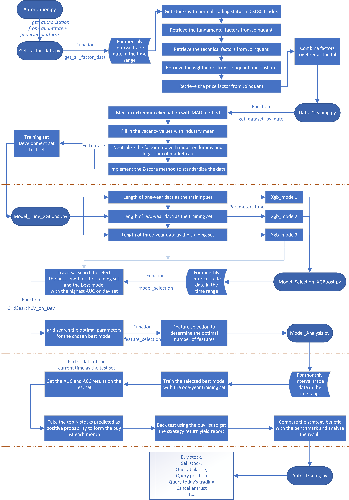

# **Stock Prediction and Quantitative Analysis Based on Machine Learning Method**

The project has set up a complete investment system pipeline based on the multifactor and machine learning model. The system mainly includes the process of data preparation, model selection and strategy generation. 


The workflow is to use the data of the whole year before the current time as the training set and implement the optimized XGBoost model to predict the stock return yield of the next month at the current time, after which selecting the top 50 stocks that most likely to rise in the next month for equal weight investment. And then employ the automated trading system to automatically maintain the portfolio on the designated trading day.


The project composed of report and codes.

## Abstract

The stock market is affected by many factors which leads to drastic internal changes that are hard to predict. With the rapid development of the stock market, large quantities of data have been generated concerning stocks, which are suitable for implementing machine learning methods to analyze and learn from the data to find the internal patterns.

 

This paper studies the intrinsic relationship between the stocks’ multiple factors and the investment value of the stocks listed in China Securities Index (CSI) 800 Index through the machine method. The investment system pipeline has been implemented including data acquirement, data preprocessing, model tuning and selection based on the XGBoost boosted tree model. 

 

The multi-factor data from the year 2010 to the year 2020 have been selected to predict the monthly stocks’ return yield. The system takes a year’s data prior to the current time as the training set, separate the training set in chronological order as the development set for 5 folders cross-validation, take the stocks’ multi-factor data of the current time as the test set, to predict the stocks’ next month’s return yield, after which a list of the stocks that worth buying each month is generated.

 

The system achieved total strategy returns of 200.08% with the excess returns of 122.25%, sharp ratio of 0.287, information ratio of 0.689, whereas the total returns of the benchmark CSI 300 Index were 35.38% in the backtesting from 2010 to 2020. The strategy returns far exceed the benchmark, which indicated that the system could be used as the method to auxiliary the quantitative stock selection, which can provide helpful suggestions on investment for retail investors.

## Requirements

There are several python libraries requirement for the project which has shown in requirements.txt.


To install the libraries, use the command line to deploy installation from [[PyPI]](https://pypi.python.org/pypi) using pip.

```python
    > pip install package_name
```

Or simply use command below if you have installed [[Anaconda]](https://www.anaconda.com/distribution/).
```python
    > conda install package_name
```


## Usage

- ### Fill up the quantitative platform accounts:

  1. Apply the Jointquant accounts and Tushare token.
  2. Fill up the Joinquant_account _lists and Tushare_token in Authorization.py (multiple instances can  run simultaneously using different Joinquant accounts at the same time, modify the index in "authorization" function).

- ### Run the program

  **Local:**

  To run the program locally. 

  Navigate to root directory of the project folder with terminal and use the command line with the following to run the corresponding .py file.

  ```python
      > python file_name.py
  ```

  

  **Colab:**

  To run the program in Colab. 

  Compress the dataset folder as "Dataset.zip". Upload  the "Py.zip" which located in local Colab folder and "Dataset.zip" to the corresponding Colab path (Default path: /content/drive/My Drive/Colab Notebooks/Dissertation/Factor/).

  Run the specified .ipynb file directly in Colab.

  

  **Other:**

  The local Colab folder contains the same programs in .ipynb format as the .py files in root. 

  .py files used to run locally while .ipynb files run in Colab.

## Program Activity Diagram

The program is executed in the following order,

Data acquirement -> Data preprocessing -> Model tuning -> Model selection -> Model analysis 

 -> Automated trading

 

The program activity diagram is shown below.




### Document interpretation

* `Authorization.py`: Get authorization from each quantitative financial database for obtaining data.

* `Get_factor_Data.py`: Retrieve the factor data from the quantitative financial database.
* `Data_Cleaning.py`: Implement the data cleaning of the factor data.
* `Model_Tune_XGBoost.ipynb`: Generate the corresponding three optimal models of the the three different lengths of the training sets.
* `Model_Selection_XGBoost.py`: Model selection process of the date in the date_list.
* `Model_analysis.py`: Result analysis of the accuracy and feature importance. Generate the stocks recommended buying list.
* `Buy_stock_strategy.py`: Backtest the strategic return according to the buy list.
* `Auto_Trading.py`: Preliminary exploration of automated trading.
## Running Error
Several running errors may encountered while running.
* XGBoost version not compiled with GPU support.

  The error shows due to the current environment does not support GPU acceleration while most of the saved model have configured in GPU acceleration mode.

  Call the un_gpu function to alternate the model to non-GPU acceleration mode in the corresponding line. 
```Python
	model=model_ungpu(model)
```

* Various problems encountered after unzipping the file from google drive to Colab or uploading the new files to Colab.

  Runtime needs to be restarted. Alternate the Colab setting.

  Settings -> Runtime -> Restart Runtime (Shortcut: Ctrl+M .)